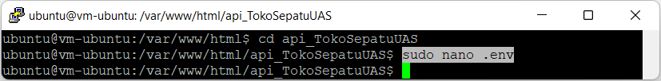
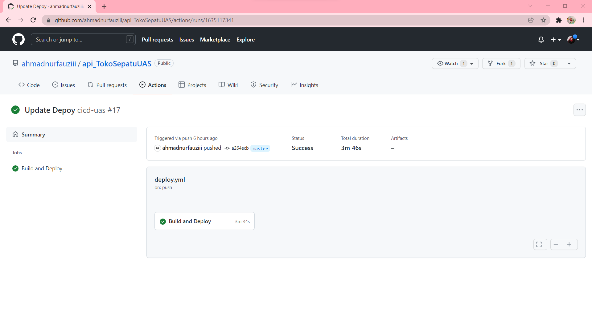

# 16 - UAS

## STUDI KASUS UAS

## KOMPONEN PENILAIAN UAS

## HASIL UAS

### IaaS

- Instance

    

- Storage

    

- Network

    

### VCN -> Port 3000

- Port 3000

    

    

### PaaS

- PaaS

    

    

    

    

    

    

    

    

    

    

    

    

    

    

    

    

    

### SaaS

- Product Categories

    

    

    

    

    

    

    

    

- Product

    

    

    

    

    

    

    

    

    

    

- Product Galleries

    

    

    

    

    

    

    

    

### Cloud Storage

- Object Storage

    

### Container

- Container

    

### Push ke Docker Hub

- Docker Hub

    

### Repo Private ( System Backend + Dockerfile) di Github

- System Backend

    

- Dockerfile

    

### CICD

- CI/CD

    